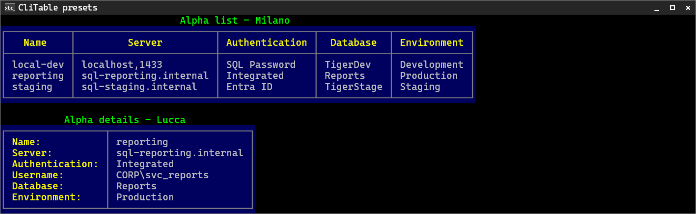
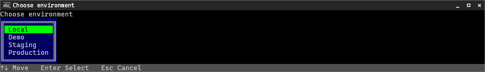

# TigerCli

TigerCli is an opinionated .NET framework for building script-safe, command-driven CLI/TUI applications that share one model across automation, guided human interaction, and AI-assisted development.

It is built for CLI apps that need predictable automation behavior, structured terminal output, governed input, metadata-driven help, typed exit codes, locale-aware text, and tests that run at the application boundary.

TigerCli is still evolving. The core direction is deliberate, but docs and examples are being productized as the framework grows out of real TigerWrap and `tiger-sqlcmd` needs.

## What It Looks Like

Structured output — `CliTable` list and details presets ([more presets](docs/examples/cli-table-presets.html), generated from real rendering):



Semi-interactive prompts — the framework-owned select dialog ([storyboards](docs/examples/tui-storyboards.html)):



These images are generated documentation artifacts, not screenshots: real TigerCli rendering captured through the render pipeline and drift-tested against the code. See [docs/examples/](docs/examples/README.md).

## What TigerCli Provides

- Command paths, positional arguments, and options
- Generated help from command and settings metadata
- Framework-owned `--non-interactive` and semi-interactive interaction modes
- Parser-driven prompts for missing governed input
- Provider-backed select prompts with async provider loading UI
- Typed exit codes and `--help-errors`
- `CliList`, `CliDetails`, `CliTable`, and `CliGrid` structured output
- Activity/progress dialogs through `RunActivityAsync`
- Command menu for semi-interactive command discovery
- Localization support for framework and app CLI text
- App-level testing harness for arguments, prompts, output, errors, and exit codes

## Why TigerCli Exists

TigerCli grew out of building real developer tools where existing CLI libraries did not fit the desired interaction model.

Those tools need to be scriptable by default, helpful when used by humans, and safe in automation. TigerCli treats accidental prompts in CI, scheduled tasks, and shell scripts as framework problems, not caller problems. It also keeps command metadata, help, prompts, exit codes, and localization in one model instead of scattering them across ad-hoc console code.

## Why TigerCli Might Not Be the Right Choice for You

TigerCli is intentionally opinionated.

It may not be the best fit if you want:

- A neutral or highly customizable CLI parser
- A large catalog of rich-console widgets
- Shell-completion-first workflows
- Full-screen terminal applications
- A general-purpose substitute for rich-console widget libraries

TigerCli works best when you accept its assumptions:

- Commands are async.
- Help is metadata-driven.
- Exit codes can be typed and documented.
- `--non-interactive` is owned by the framework.
- Positional arguments come before options.
- Missing input is handled through inline semi-interactive prompts, not ad-hoc `Console.ReadLine()` calls.

## Documentation

Start with the full documentation index: [docs/README.md](docs/README.md).

Common entry points:

- [Using TigerCli with AI coding agents](docs/ai-usage.md)
- [Getting started](docs/getting-started.md)
- [Folder Copy sample](docs/examples/folder-copy.md)
- [Command apps](docs/guides/command-apps.md)
- [CRUD command apps](docs/guides/crud-commands.md)
- [Prompting and providers](docs/guides/prompting-and-providers.md)
- [Semi-interactive prompts](docs/guides/semi-interactive-prompts.md)
- [App testing](docs/guides/app-testing.md)
- [Localization](docs/guides/localization.md)
- [Exit codes](docs/guides/exit-codes.md)
- [Structured output](docs/guides/structured-output.md)

## Sample Apps

The [getting started](docs/getting-started.md) guide is built around two small example apps, [`RoiCities.Basic/`](RoiCities.Basic/) and [`RoiCities.Extended/`](RoiCities.Extended/) — the same `list`/`show` app first in its core script-safe shape, then with the richer TigerCli UX (provider-backed selection, command menu, typed exit codes). [`RoiCities.Tests/`](RoiCities.Tests/) covers both at the app boundary.

[`FolderCopy/`](FolderCopy/) is the real-operation sample. It uses a single default command, required folder-select options, folder picker prompts, a scanning phase, a rich `RunActivityAsync` copy dialog with progress rows, cancellation-aware work, strict `--non-interactive` behavior, and TigerCli-free planner logic tested with temporary folders. See the concise [Folder Copy sample documentation](docs/examples/folder-copy.md).

[`CommandParserTest/`](CommandParserTest/) is the broad dogfooding sample: command groups, positional arguments and options, parser-driven prompts, provider-backed choices (including a `[Flags]` multi-select), dependent providers, typed exit codes with `--help-errors`, and en-US/pl-PL localization. The name reflects its dogfooding origin; it is a runnable sample app, not a test suite.

[`CommandParserTest.Tests/`](CommandParserTest.Tests/) is its matching app-boundary test project: it runs the real app through `TigerCliAppTestHost` and asserts arguments, output, errors, localization, and exit codes — the approach described in [app testing](docs/guides/app-testing.md).

```bash
dotnet run --project RoiCities.Extended -- --help
dotnet run --project FolderCopy -- --help
dotnet run --project CommandParserTest -- --help
dotnet test RoiCities.Tests/RoiCities.Tests.csproj
dotnet test FolderCopy.Tests/FolderCopy.Tests.csproj
dotnet test CommandParserTest.Tests/CommandParserTest.Tests.csproj
```

## Build and Test

**Requirements:** .NET 10 SDK

```bash
dotnet build TigerCli.sln
dotnet test ItTiger.TigerCli.Tests/ItTiger.TigerCli.Tests.csproj
```

## Project Shape

The main library lives in `ItTiger.TigerCli/`.

```text
Commands/       Command parsing, handlers, help, prompts, exit codes
Rendering/      Grids, frames, tables, buffers, structured output
Tui/            Semi-interactive controls, shells, themes
Terminal/       TigerConsole and render sinks
Markup/         Styled text parsing
Primitives/     Colors, alignment, characters, shared values
Enums/          Shared rendering and interaction options
```

Tests live in `ItTiger.TigerCli.Tests/`. Documentation lives in `docs/`.

## License

See [LICENSE](LICENSE) for details.
