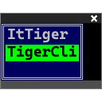
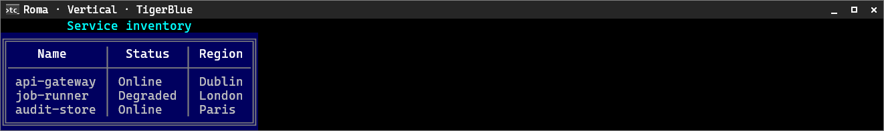
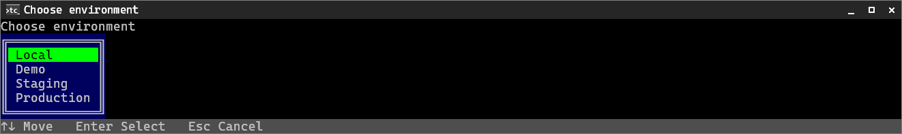
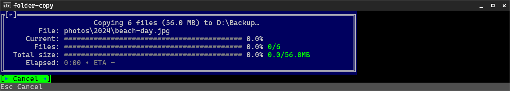

# TigerCli

<p align="center">
  
</p>

TigerCli is an opinionated .NET framework for building script-safe, command-driven CLI/TUI applications that share one model across automation, guided human interaction, and AI-assisted development.

It is built for CLI apps that need predictable automation behavior, structured terminal output, governed input, metadata-driven help, typed exit codes, locale-aware text, and tests that run at the application boundary.

TigerCli is pre-1.0 and approaching stabilization. Its documentation, examples, generated artifacts, API reference, package publishing, and release process are now part of the framework, not afterthoughts.

## One Command Model, Multiple Interaction Modes

Command code describes the input and operation it needs; TigerCli owns the interaction policy. The same command implementation can serve people through menus, prompts, selectors, providers, validation, and activity/progress UI, while scripts, CI jobs, and AI agents use explicit, discoverable command shapes.

With `--non-interactive`, TigerCli disables prompts for the selected command. A command still executes when all required input is supplied; missing input that could otherwise be prompted for fails clearly instead of blocking automation. An app configured to run non-interactively also refuses command menus. Activities and progress run headlessly or emit stable non-interactive messages according to their configuration.

TigerCli command lines use one shape: `app <command-path> <positional-arguments> [options]`.
Framework execution options such as `--non-interactive` and app-contributed global options are
app-wide in meaning, but they still appear after the command path and required positionals. A
default/root command has an empty command path, so its shape is
`app <positional-arguments> [options]` and options may start at the first token when it declares no
positionals. Root `--help`, `--version`, `--help-errors`, and `--help-env` are informational forms,
not pre-command execution options; they share the options area, so `app --help --theme light`
works.

Generated help is rendered as full-width themed `CliGrid` documents. Entries intentionally use a
key line followed by an indented description; measured wrapping preserves that indentation, while
the theme's Text-over-Background document base paints coherent complete rows. `AnsiSink` is
terminal-bounded by default, so help and other structured output wrap during layout.

Mode changes presentation and prompting policy; it should not change the business operation. App authors should not need separate interactive and automation implementations.

## Install

Install the main TigerCli package:

```bash
dotnet add package ItTiger.TigerCli --version 0.9.3
```

`ItTiger.Core` is also available separately for shared support utilities:

```bash
dotnet add package ItTiger.Core --version 0.9.3
```

The optional PNG rendering sink is packaged separately for documentation and visual artifacts:

```bash
dotnet add package ItTiger.TigerCli.PngSink --version 0.9.3
```

## What It Looks Like

Structured output — generated `CliTable` style presets ([compare every preset](docs/guides/cli-table.md)):



Semi-interactive prompts — the framework-owned select dialog ([prompt guide](docs/guides/semi-interactive-prompts.md)):



These images are generated documentation artifacts, not screenshots: real TigerCli rendering captured through the render pipeline and drift-tested against the code. See [docs/examples/](docs/examples/README.md).

Activity dialogs can show live progress while the same operation remains script-safe in non-interactive mode.



## What TigerCli Provides

- Command paths, positional arguments, and options
- Generated help from command and settings metadata
- Framework-owned `--non-interactive` and semi-interactive interaction modes
- Parser-driven prompts for missing governed input
- Provider-backed select prompts with async provider loading UI
- Typed exit codes and `--help-errors`
- Composable `--help-env` output for framework and app/library environment-variable metadata
- [CliList&lt;T&gt;](https://rkozlowski.github.io/TigerCli/api/ItTiger.TigerCli.Rendering.CliList-1.html), [CliDetails](https://rkozlowski.github.io/TigerCli/api/ItTiger.TigerCli.Rendering.CliDetails.html), `CliTable`, and `CliGrid` structured output
- Activity/progress dialogs through `RunActivityAsync`
- Command menu for semi-interactive command discovery
- Localization support for framework and app CLI text
- App-level testing harness for arguments, prompts, output, errors, and exit codes

## Why TigerCli Exists

TigerCli grew out of building real developer tools where existing CLI libraries did not fit the desired interaction model.

Those tools need to be scriptable by default, helpful when used by humans, and safe in automation. TigerCli treats accidental prompts in CI, scheduled tasks, and shell scripts as framework problems, not caller problems. It also keeps command metadata, help, prompts, exit codes, and localization in one model instead of scattering them across ad-hoc console code.

## Why TigerCli Might Not Be the Right Choice for You

TigerCli is intentionally opinionated.

It may not be the best fit if you want:

- A neutral or highly customizable CLI parser
- A large catalog of rich-console widgets
- Shell-completion-first workflows
- Full-screen terminal applications
- A general-purpose substitute for rich-console widget libraries

TigerCli works best when you accept its assumptions:

- Commands are async.
- Help is metadata-driven.
- Exit codes can be typed and documented.
- `--non-interactive` is owned by the framework.
- Positional arguments come before options.
- Missing input is handled through inline semi-interactive prompts, not ad-hoc `Console.ReadLine()` calls.

## Documentation

Start with the full documentation index: [docs/README.md](docs/README.md).
Browse the published [API documentation](https://rkozlowski.github.io/TigerCli/index.html).

Common entry points:

- [Using TigerCli with AI coding agents](docs/ai-usage.md)
- [Getting started](docs/getting-started.md)
- [Folder Copy sample](docs/examples/folder-copy.md)
- [Command apps](docs/guides/command-apps.md)
- [CRUD command apps](docs/guides/crud-commands.md)
- [Prompting and providers](docs/guides/prompting-and-providers.md)
- [Semi-interactive prompts](docs/guides/semi-interactive-prompts.md)
- [App testing](docs/guides/app-testing.md)
- [Localization](docs/guides/localization.md)
- [Exit codes](docs/guides/exit-codes.md)
- [Structured output](docs/guides/structured-output.md)

## Sample Apps

The [getting started](docs/getting-started.md) guide is built around two small example apps, [`RoiCities.Basic/`](RoiCities.Basic/) and [`RoiCities.Extended/`](RoiCities.Extended/) — the same `list`/`show` app first in its core script-safe shape, then with the richer TigerCli UX (provider-backed selection, command menu, typed exit codes). [`RoiCities.Tests/`](RoiCities.Tests/) covers both at the app boundary.

[`FolderCopy/`](FolderCopy/) is the real-operation sample. It uses a single default command, required folder-select options, folder picker prompts, a scanning phase, a rich `RunActivityAsync` copy dialog with progress rows, cancellation-aware work, strict `--non-interactive` behavior, and TigerCli-free planner logic tested with temporary folders. See the concise [Folder Copy sample documentation](docs/examples/folder-copy.md).

[`CommandParserTest/`](CommandParserTest/) is the broad dogfooding sample: command groups, positional arguments and options, parser-driven prompts, provider-backed choices (including a `[Flags]` multi-select), dependent providers, typed exit codes with `--help-errors`, and en-US/pl-PL localization. The name reflects its dogfooding origin; it is a runnable sample app, not a test suite.

[`CommandParserTest.Tests/`](CommandParserTest.Tests/) is its matching app-boundary test project: it runs the real app through `TigerCliAppTestHost` and asserts arguments, output, errors, localization, and exit codes — the approach described in [app testing](docs/guides/app-testing.md).

```bash
dotnet run --project RoiCities.Extended -- --help
dotnet run --project FolderCopy -- --help
dotnet run --project CommandParserTest -- --help
dotnet test RoiCities.Tests/RoiCities.Tests.csproj
dotnet test FolderCopy.Tests/FolderCopy.Tests.csproj
dotnet test CommandParserTest.Tests/CommandParserTest.Tests.csproj
```

## Build and Test

**Requirements:** .NET 10 SDK

```bash
dotnet build TigerCli.sln
dotnet test ItTiger.TigerCli.Tests/ItTiger.TigerCli.Tests.csproj
```

## Project Shape

The main library lives in `ItTiger.TigerCli/`.

```text
Commands/       Command parsing, handlers, help, prompts, exit codes
Rendering/      Grids, frames, tables, buffers, structured output
Tui/            Semi-interactive controls, shells, themes
Terminal/       TigerConsole and render sinks
Markup/         Styled text parsing
Primitives/     Colors, alignment, characters, shared values
Enums/          Shared rendering and interaction options
```

Tests live in `ItTiger.TigerCli.Tests/`. Documentation lives in `docs/`.

## License

See [LICENSE](LICENSE) for details.

## Copyright & Project Sponsor

<p align="left">
  
</p>

TigerCli is an open-source project by **IT Tiger**  
🔗 https://www.ittiger.net/

TigerCli project page: https://www.ittiger.net/projects/tigercli/
