# Progress bar styles

<!-- GENERATED FILE — do not edit. Regenerate with: dotnet run --project internal/DocSamples -- progress-bars -->

Animated previews of every `ProgressBarStyle` × `ProgressBarCaps` combination in the
`Single` and `ThreeColor` colour modes, captured from the real `TigerTui.RunActivityAsync`
dialog on a scripted `TestShell` with a manual clock (`TwoColor` is `ThreeColor` without
the distinct 100% recolour, so it is not shown separately). The bar sits in a star-sized
column with a right-aligned percentage cell; the operation steps progress from 0% to 100%
in 1% increments. Each rendered frame becomes a PNG through `PngSink` and the frames are
assembled into a looping WebP: 100 ms per step, with the 100% frame held for 2 seconds
before the loop restarts. In `ThreeColor` mode note the bar recolouring at exactly 100%.
The title bar shows the raw-frame spinner prefix an app with terminal title management
gets on its real window/tab title; the bracketed frame on the dialog's top border is the
activity overlay.

## ProgressBarStyle.Default

### ProgressBarCaps.None · ProgressBarColorMode.Single

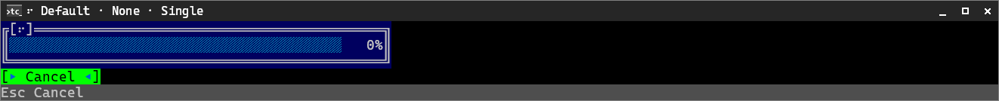

### ProgressBarCaps.None · ProgressBarColorMode.ThreeColor

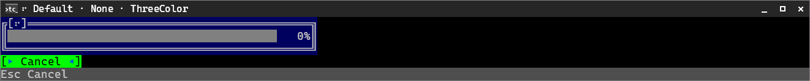

### ProgressBarCaps.Brackets · ProgressBarColorMode.Single

### ProgressBarCaps.Brackets · ProgressBarColorMode.ThreeColor

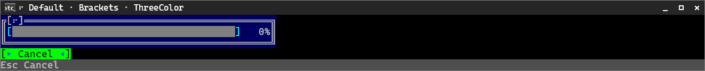

## ProgressBarStyle.Line

### ProgressBarCaps.None · ProgressBarColorMode.Single

### ProgressBarCaps.None · ProgressBarColorMode.ThreeColor

### ProgressBarCaps.Brackets · ProgressBarColorMode.Single

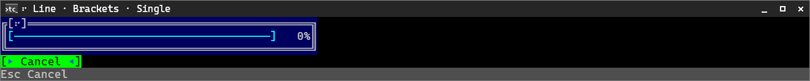

### ProgressBarCaps.Brackets · ProgressBarColorMode.ThreeColor

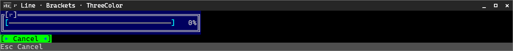

## ProgressBarStyle.Square

### ProgressBarCaps.None · ProgressBarColorMode.Single

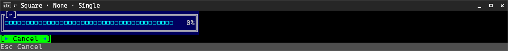

### ProgressBarCaps.None · ProgressBarColorMode.ThreeColor

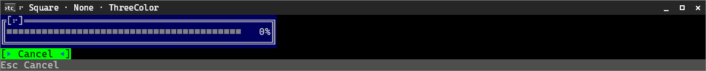

### ProgressBarCaps.Brackets · ProgressBarColorMode.Single

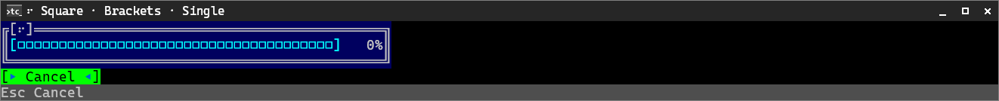

### ProgressBarCaps.Brackets · ProgressBarColorMode.ThreeColor

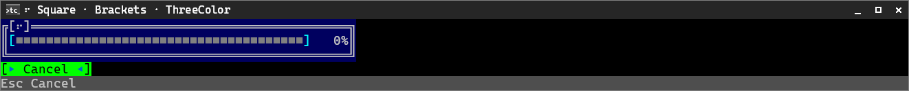

## ProgressBarStyle.VerticalBar

### ProgressBarCaps.None · ProgressBarColorMode.Single

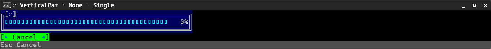

### ProgressBarCaps.None · ProgressBarColorMode.ThreeColor

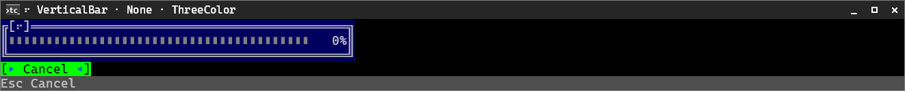

### ProgressBarCaps.Brackets · ProgressBarColorMode.Single

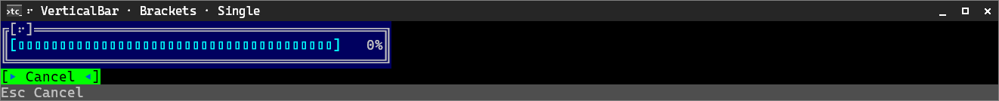

### ProgressBarCaps.Brackets · ProgressBarColorMode.ThreeColor

## ProgressBarStyle.Dash

### ProgressBarCaps.None · ProgressBarColorMode.Single

### ProgressBarCaps.None · ProgressBarColorMode.ThreeColor

### ProgressBarCaps.Brackets · ProgressBarColorMode.Single

### ProgressBarCaps.Brackets · ProgressBarColorMode.ThreeColor

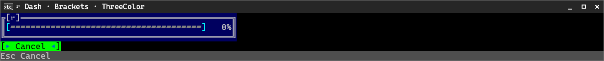

