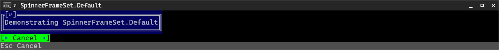
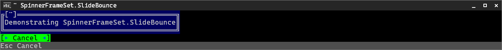
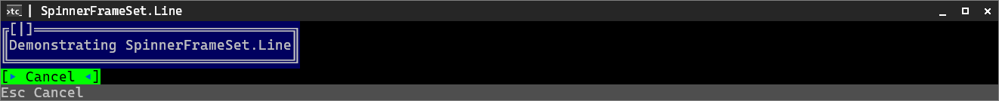

# Spinner frame sets

<!-- GENERATED FILE — do not edit. Regenerate with: dotnet run --project internal/DocSamples -- spinners -->

Animated previews of every `SpinnerFrameSet`, captured from the real
`TigerTui.RunActivityAsync` dialog on a scripted `TestShell` with a manual clock.
Each spinner frame is rendered to PNG through `PngSink` and the frames are
assembled into a looping WebP at the default 500 ms frame period.
The title bar shows the raw-frame spinner prefix an app with terminal title
management gets on its real window/tab title; the bracketed frame on the dialog's
top border is the activity overlay.

## SpinnerFrameSet.Default

Frames (4): `⠖` `⠲` `⠴` `⠦`

## SpinnerFrameSet.Dots6

Frames (6): `⠇` `⠋` `⠙` `⠸` `⠴` `⠦`

## SpinnerFrameSet.Dots8

Frames (8): `⡇` `⠏` `⠛` `⠹` `⢸` `⣰` `⣤` `⣆`

## SpinnerFrameSet.Slide

Frames (4): `⠉` `⠒` `⠤` `⣀`

## SpinnerFrameSet.SlideBounce

Frames (6): `⠉` `⠒` `⠤` `⣀` `⠤` `⠒`

## SpinnerFrameSet.Snake

Frames (8): `⢎ ` `⠎⠁` `⠊⠑` `⠈⠱` ` ⡱` `⢀⡰` `⢄⡠` `⢆⡀`

## SpinnerFrameSet.Line

Frames (4): `|` `/` `—` `\`

