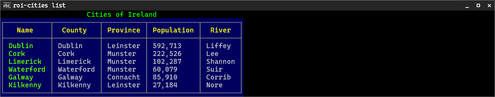
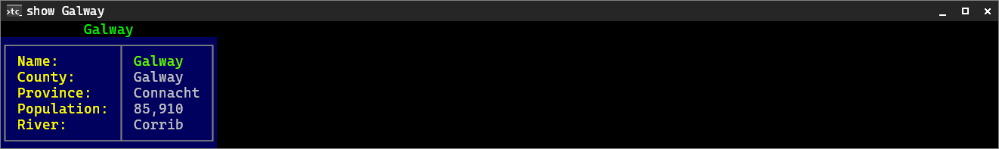
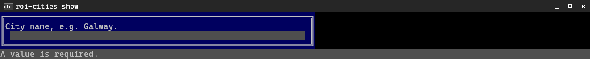
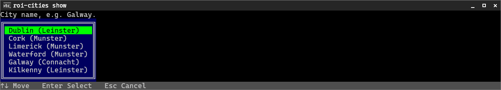
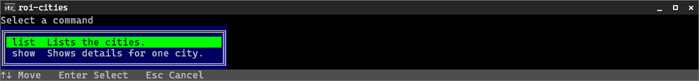

# Getting Started

TigerCli is for command-line apps that are **script-safe first** and helpful to humans when a terminal is interactive. The same command runs strictly under automation — missing input fails fast, nothing ever waits for a key — and asks for what is missing when a human runs it, without the app writing any prompt code.

This page shows that with two small example apps around one tiny domain, cities of the Republic of Ireland:

- [`RoiCities.Basic`](../RoiCities.Basic/) — the core TigerCli app shape: commands, structured output, framework-owned prompting policy.
- [`RoiCities.Extended`](../RoiCities.Extended/) — the same app with TigerCli's richer UX turned on: provider-backed selection, a command menu, typed exit codes, and version metadata.

Every screenshot below is a generated, drift-tested render of the real apps — see the inspectable HTML page [ROI Cities](examples/roi-cities.html) and [rendered examples](examples/README.md).

## The Basic App

`roi-cities` has a `list` command and a `show` command over a small in-memory city store:

```bash
roi-cities list           # all cities as a table
roi-cities show Galway    # one city in detail
roi-cities --help
```

`Program.cs` is one line:

```csharp
using RoiCities.Basic;

return await RoiCitiesApp.Create().RunAsync(args);
```

The app itself is built by a factory class:

```csharp
using ItTiger.TigerCli.Commands;

public static class RoiCitiesApp
{
    public static TigerCliApp Create()
    {
        var store = new CityStore();

        return TigerCliApp.CreateBuilder()
            .SetApplicationName("roi-cities")
            .AddDescription("Cities of the Republic of Ireland.")
            .AddCommand("list", () => new ListCommand(store), "Lists the cities.")
            .AddCommand("show", () => new ShowCommand(store), "Shows details for one city.")
            .Build();
    }
}
```

> This basic sample sets the name inline to stay self-contained. A real app defines its identity and product metadata in the project file and imports it with `UseAssemblyMetadata(...)` — the extended app below shows that normal pattern ([command apps → app metadata](guides/command-apps.md#app-metadata)).

Two things are already at work here:

- **Composition is plain factory closures.** Both commands receive the store through their constructors — no DI container, no ambient statics. `CityStore` is ordinary application code (a `City` record and a lookup over six cities); see [`CityStore.cs`](../RoiCities.Basic/CityStore.cs).
- **The factory shape makes the app testable at its boundary.** `Program.cs` and the tests build the *same* app object, so `TigerCliAppTestHost` exercises the real pipeline — parsing, prompting policy, output, exit codes ([app testing](guides/app-testing.md)).

### The list command

A `list` command declares its columns once with `CliList` and renders the items — no manual padding, alignment, or loops:

```csharp
public sealed class ListCommand(CityStore store) : TigerCliAsyncCommandHandler<ListSettings>
{
    public override Task<int> ExecuteAsync(ListSettings settings)
    {
        TigerConsole.Render(CityList().Render(store.All));
        return Task.FromResult(0);
    }

    public static CliList<City> CityList() => new CliList<City>()
        .AddTitle("Cities of Ireland")
        .AddKeyColumn("Name", city => city.Name)
        .AddColumn("County", city => city.County)
        .AddColumn("Province", city => city.Province)
        .AddColumn("Population", city => city.PopulationDisplay)
        .AddColumn("River", city => city.River);
}
```



`AddKeyColumn` marks the name as the identity value; the active theme decides the ink. The layout is measured against the real terminal width, so wrapping and truncation are framework behavior, not command code ([structured output](guides/structured-output.md)).

### The show command and its selector

`show` takes the city as a **positional argument** — a selector that answers "which object?", declared on a settings class:

```csharp
public sealed class ShowSettings : TigerCliSettings
{
    [TigerCliArgument(0, Name = "city", Description = "City name, e.g. Galway.")]
    public string CityName { get; set; } = string.Empty;
}
```

The handler looks the city up and renders one record as a `CliDetails` label/value view:

```csharp
public sealed class ShowCommand(CityStore store) : TigerCliAsyncCommandHandler<ShowSettings>
{
    public override Task<int> ExecuteAsync(ShowSettings settings)
    {
        var city = store.Find(settings.CityName);
        if (city is null)
        {
            TigerConsole.MarkupErrorLine(settings.E("[Error]Unknown city:[/] {0}", settings.CityName));
            return Task.FromResult(1);
        }

        TigerConsole.Render(CityDetails(city));
        return Task.FromResult(0);
    }

    public static CliDetails CityDetails(City city) => new CliDetails()
        .AddTitle(city.Name)
        .AddKey("Name:", city.Name)
        .Add("County:", city.County)
        .Add("Province:", city.Province)
        .Add("Population:", city.PopulationDisplay)
        .Add("River:", city.River);
}
```



Selectors are positional; values that describe or configure the object stay options ([arguments and options](guides/arguments-and-options.md)). Errors go to stderr via `MarkupErrorLine`, keeping stdout clean for pipelines.

### What happens when the city is missing

This is where TigerCli differs from a plain argument parser. Run `roi-cities show` with no city in a terminal, and the framework prompts for the missing selector — the command wrote no prompt code:



Run the same thing under automation, and it fails cleanly instead:

```bash
roi-cities show --non-interactive
# stderr: Error: Missing required argument: <city>
# exit code: non-zero — the run never waits for a key
```

`--non-interactive` is framework-owned and available to every TigerCli app. The prompt/fail decision is interaction *policy*, not command logic ([interaction modes](guides/interaction-modes.md)).

### Testing the app boundary

Because the app is built by a factory, tests run the whole real pipeline — including the prompt flow — without a terminal:

```csharp
var result = await TigerCliAppTestHost
    .For(RoiCitiesApp.Create())
    .WithArgs("show")
    .WithTextInput("Galway")
    .RunAsync();

Assert.Equal(0, result.ExitCode);
Assert.Contains("Corrib", result.StdOut);
```

See [`RoiCities.Tests`](../RoiCities.Tests/) for the full set (list output, show output, the prompt flow, and the non-interactive failure), and [app testing](guides/app-testing.md) for the host API.

## The Extended App

[`RoiCities.Extended`](../RoiCities.Extended/) is the same store and the same two commands, with the richer TigerCli UX turned on in the factory:

```csharp
return TigerCliApp.CreateBuilder()
    .UseAssemblyMetadata(typeof(RoiCitiesApp).Assembly)
    .UseExitCodes(RoiCitiesExitCode.Ok, RoiCitiesExitCode.InternalError)
        .ExitKind(TigerCliExitKind.InvalidArguments, RoiCitiesExitCode.InvalidArguments)
        .ExitKind(TigerCliExitKind.MissingRequiredArgument, RoiCitiesExitCode.MissingRequiredArgument)
        .ExitKind(TigerCliExitKind.ValidationError, RoiCitiesExitCode.ValidationError)
        .ExitKind(TigerCliExitKind.InteractiveNotAllowed, RoiCitiesExitCode.InteractiveNotAllowed)
        .ExitKind(TigerCliExitKind.Cancelled, RoiCitiesExitCode.Cancelled)
    .UseCommandMenu(CommandMenuMode.Enabled)
    .AddCommand("list", () => new ListCommand(store), "Lists the cities.")
    .AddCommand("show", () => new ShowCommand(store), "Shows details for one city.")
    .ConfigureProviders(providers => providers.Add<string>("cities", _ =>
        store.All
            .Select(city => new OptionItem<string>(city.Name, $"{city.Name} ({city.Province})"))
            .ToArray()))
    .Build();
```

### Provider-backed selection

The `show` selector now references the `cities` provider:

```csharp
[TigerCliArgument(0, Name = "city", Provider = "cities", Description = "City name, e.g. Galway.")]
public string CityName { get; set; } = string.Empty;
```

A missing city becomes a select over the store's cities instead of a free-text input — the value bound to the command is the stable key (`Galway`), while the label is display text:



The provider also validates supplied values: `roi-cities show Atlantis` fails with a clear framework error before the handler runs, and `roi-cities show galway` binds the canonical `Galway`. (Opt out per member with `ValidateAgainstProvider = false` when custom values are acceptable.)

Providers are registered at app, group, or command scope and can depend on earlier answers ([prompting and providers](guides/prompting-and-providers.md)).

### Command menu

`UseCommandMenu(CommandMenuMode.Enabled)` makes a bare `roi-cities` open a picker over the registered commands — TigerCli's discoverable alternative to shell tab completion. The selected command then runs through the normal pipeline, so choosing `show` flows straight into the city select above:



The menu is interaction, so `roi-cities --non-interactive` refuses it with a clean, mapped exit code instead of opening a picker ([command apps → command menu](guides/command-apps.md#command-menu)).

### Typed exit codes

The app defines one application-wide enum, and commands return typed values (`TigerCliAsyncCommandHandler<ShowSettings, RoiCitiesExitCode>`):

```csharp
[TigerText("roi-cities exit codes")]
public enum RoiCitiesExitCode
{
    [TigerText("OK", Description = "Operation completed successfully.")]
    Ok = 0,

    [TigerText("City not found", Description = "The requested city is not in the city store.")]
    CityNotFound = 1,

    // ... framework outcomes mapped via ExitKind(...) above ...
}
```

Framework outcomes (invalid arguments, a missing selector under `--non-interactive`, a cancelled prompt) map onto the same enum through the `ExitKind` calls, and `roi-cities --help-errors` documents the whole contract to users and scripts from the `[TigerText]` labels — see the [generated render](examples/roi-cities.html) and [exit codes](guides/exit-codes.md).

### Metadata polish

Identity and product metadata — the `roi-cities` command name (`<AssemblyName>`), the `ROI Cities` display name (`<Product>`), and the `1.0.0` `<Version>` — live in `RoiCities.Extended.csproj` and are imported with `UseAssemblyMetadata(...)`, the normal pattern for a real executable app. Supplying a version lights up the framework-owned version options and help header:

```bash
roi-cities --version
# ROI Cities version 1.0.0
```

Generated help for both apps — including the extended app's version line and exit-code hint — is on the [ROI Cities examples page](examples/roi-cities.html).

## Where To Go Next

- Build commands, groups, and metadata with [command apps](guides/command-apps.md).
- Model selectors, options, and validation with [arguments and options](guides/arguments-and-options.md).
- Render lists, details, and tables with [structured output](guides/structured-output.md).
- Add prompt choices and dependent providers with [prompting and providers](guides/prompting-and-providers.md).
- Understand `--non-interactive` and prompting policy with [interaction modes](guides/interaction-modes.md).
- Define the exit-code contract with [exit codes](guides/exit-codes.md).
- Test the app boundary with [app testing](guides/app-testing.md).
- See a real-operation sample in [Folder Copy](examples/folder-copy.md): a default command with folder picker options, long-running activities, progress bars, cancellation, and non-interactive execution.
- Use [`CommandParserTest`](../CommandParserTest/) when you need the broad dogfooding app: command groups, localization, dependent providers, flags multi-select, and larger feature coverage.
