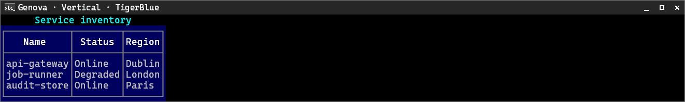
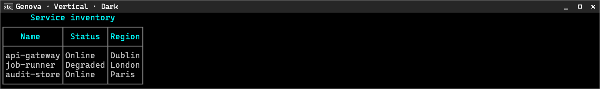
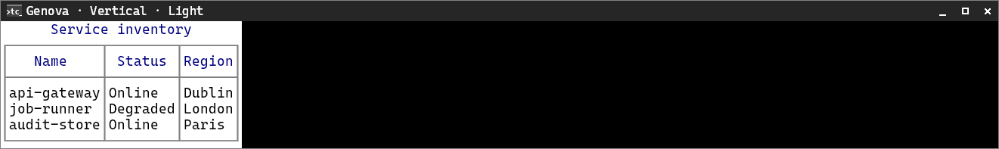
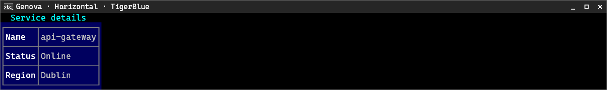
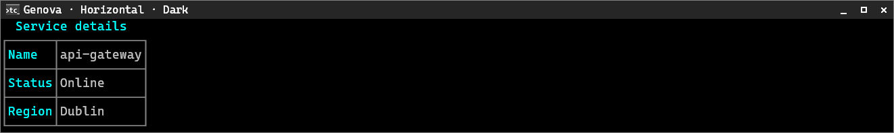
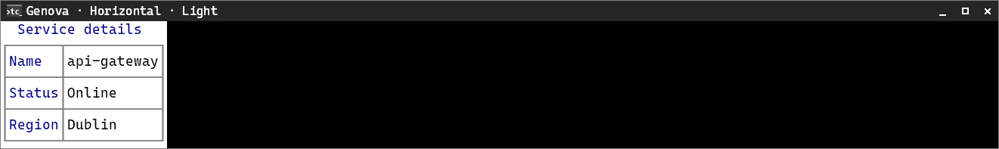

# Genova

[← Back to the CliTable guide](cli-table.md#built-in-style-presets)

Genova uses a tight single-line boxed grid with no cell padding on the panel surface.

**Supported orientation:** both.

## Vertical

**TigerBlue**

**Dark**

**Light**

## Horizontal

**TigerBlue**

**Dark**

**Light**

