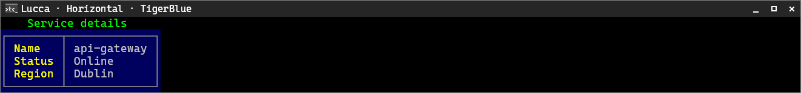
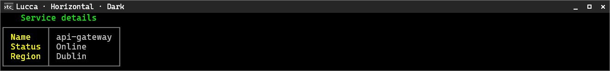
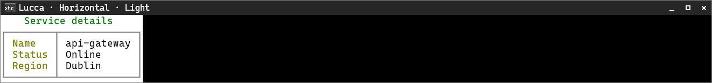

# Lucca

[← Back to the CliTable guide](cli-table.md#built-in-style-presets)

Lucca uses a Milano-based boxed detail view on the panel surface with no between-field separator.

**Supported orientation:** horizontal only.

## Horizontal

| TigerBlue | Dark | Light |
|---|---|---|
|  |  |  |
