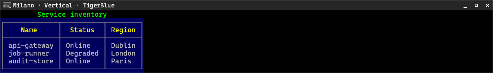
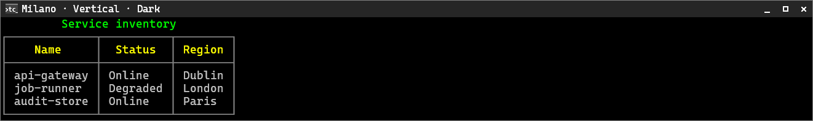
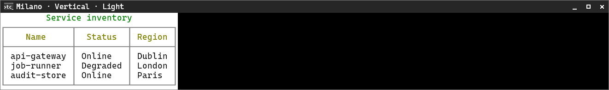
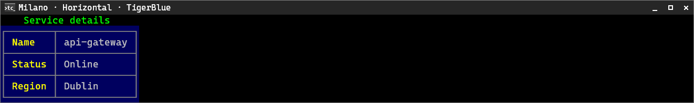
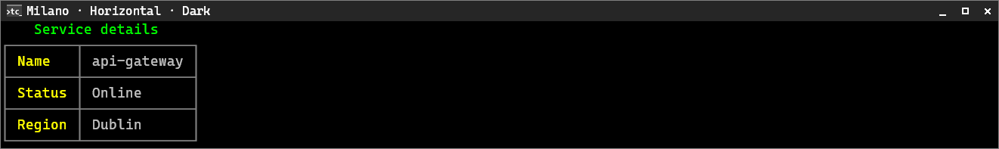
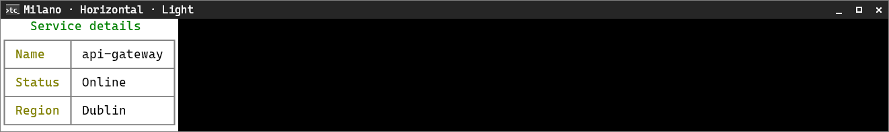

# Milano

[← Back to the CliTable guide](cli-table.md#built-in-style-presets)

Milano uses a clean single-line boxed grid on the panel surface, with a success title and warning header.

**Supported orientation:** both.

## Vertical

**TigerBlue**

**Dark**

**Light**

## Horizontal

**TigerBlue**

**Dark**

**Light**

