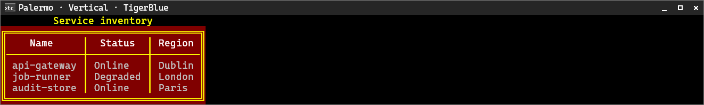
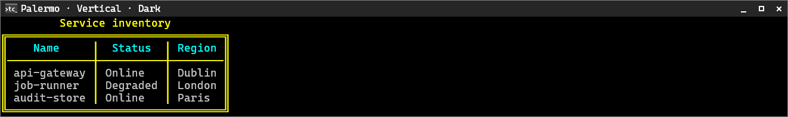
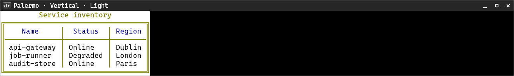
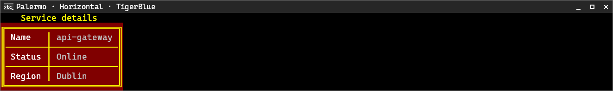
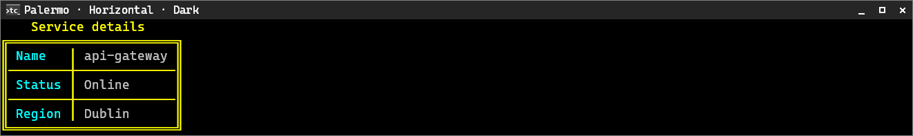
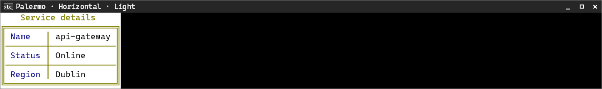

# Palermo

[← Back to the CliTable guide](cli-table.md#built-in-style-presets)

Palermo uses the alert surface with a warning title and frame for attention-focused output.

**Supported orientation:** both.

## Vertical

| TigerBlue | Dark | Light |
|---|---|---|
|  |  |  |

## Horizontal

| TigerBlue | Dark | Light |
|---|---|---|
|  |  |  |
