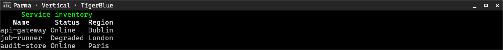
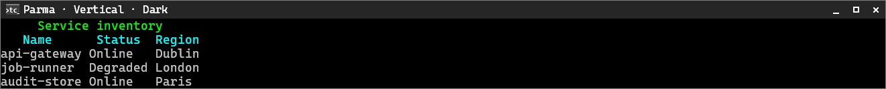
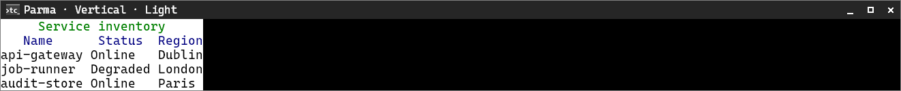

# Parma

[← Back to the CliTable guide](cli-table.md#built-in-style-presets)

Parma uses a compact frameless list with a single-space column separator.

**Supported orientation:** vertical only.

## Vertical

| TigerBlue | Dark | Light |
|---|---|---|
|  |  |  |
