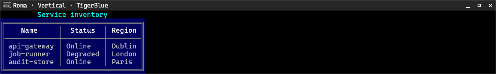
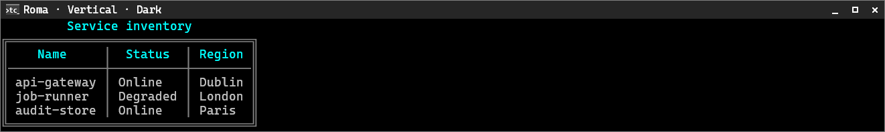
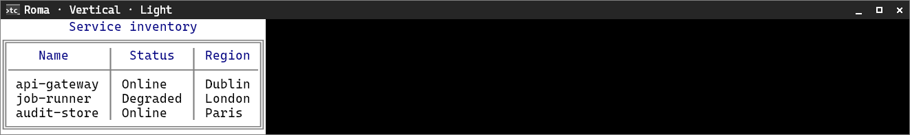
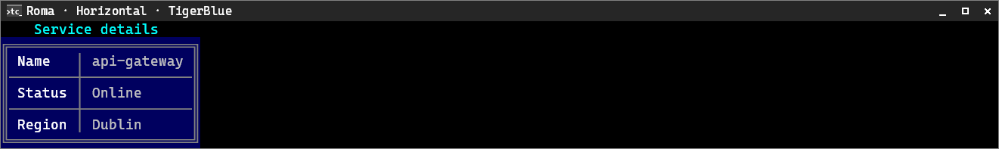
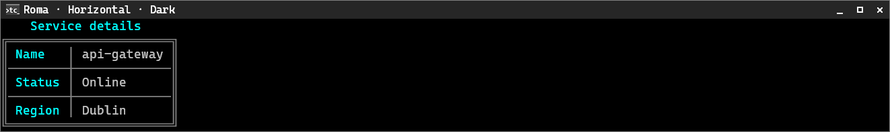
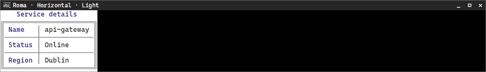

# Roma

[← Back to the CliTable guide](cli-table.md#built-in-style-presets)

Roma uses a double outer frame with a single header rule and column separators on the panel surface.

**Supported orientation:** both.

## Vertical

| TigerBlue | Dark | Light |
|---|---|---|
|  |  |  |

## Horizontal

| TigerBlue | Dark | Light |
|---|---|---|
|  |  |  |
