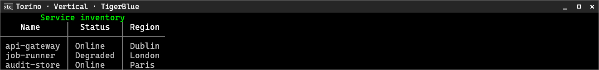
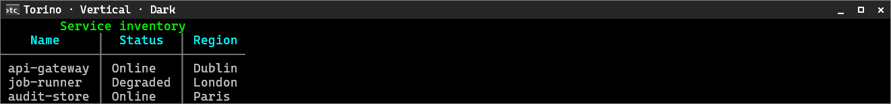
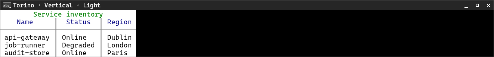
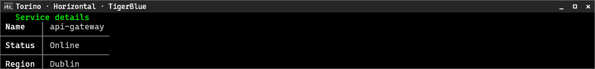
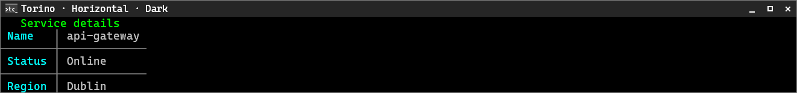
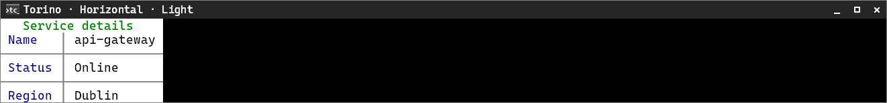

# Torino

[← Back to the CliTable guide](cli-table.md#built-in-style-presets)

Torino uses a frameless outer table with a header rule and column separators on the default surface.

**Supported orientation:** both.

## Vertical

**TigerBlue**

**Dark**

**Light**

## Horizontal

**TigerBlue**

**Dark**

**Light**

