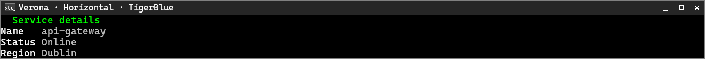
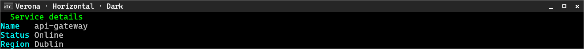
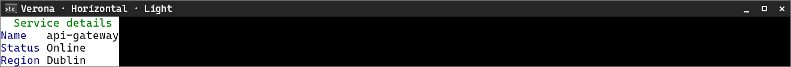

# Verona

[← Back to the CliTable guide](cli-table.md#built-in-style-presets)

Verona uses a condensed frameless detail view with left-padded values and tight headers.

**Supported orientation:** horizontal only.

## Horizontal

| TigerBlue | Dark | Light |
|---|---|---|
|  |  |  |
