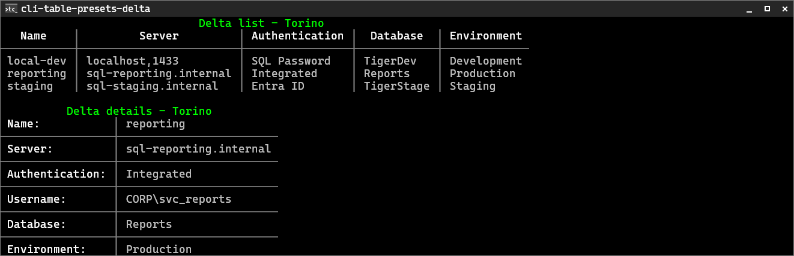

# CliTable

`CliTable` is TigerCli's table-oriented rendering API. Use it when a command needs readable tabular output without hand-counting spaces or writing layout code in the handler.

For normal CRUD `list` and `show`/details output, prefer the higher-level builders [`CliList`](structured-output.md#clilist) and [`CliDetails`](structured-output.md#clidetails) — specialized, simplified APIs built on `CliTable`. Use `CliTable` directly when those wrappers are not suitable.

## Overview

`CliTable` is for:

- readable tabular command output
- less manual spacing and padding
- predictable rendering through TigerCli's layout pipeline
- testable output that can be rendered to lines without a real console

It sits on top of TigerCli's structured rendering model:

```text
data -> CliTable -> CliGrid -> TigerConsole
```

`TigerConsole` renders the table. `CliGrid` is the lower-level layout primitive that `CliTable` produces internally. For the high-level output model, see [structured output](structured-output.md).

## When To Use CliTable

Most CRUD commands should not reach for `CliTable` first: `CliList` covers list output and `CliDetails` covers single-record detail views. Use `CliTable` directly for:

- custom or richer tabular layouts (own header/record construction, frames, orientation control)
- simple reports and query-like rows that do not fit the list/details shape
- per-field styling beyond a semantic value style

It is not the best fit for:

- complex custom layouts
- irregular grids with spans
- full-screen interaction
- highly specialized rendering

For reusable custom layouts, derive from `CliRenderableComponent` and build the low-level `CliGrid` inside `ToGrid()` — `CliGrid` is the layout/rendering layer under the table system, intended for building renderables, controls, and framework features, not the API app commands normally reach for. For interactive workflows, use TigerCli's semi-interactive prompt APIs instead of trying to build an interactive table.

## Basic Table Example

For simple tables, pick a preset, add a header in one call, then add records:

```csharp
using ItTiger.TigerCli.Enums;
using ItTiger.TigerCli.Rendering;
using ItTiger.TigerCli.Terminal;

var table = new CliTable()
    .ApplyPreset(CliTableStylePreset.Torino)
    .AddHeader(
        settings.T("Name"),
        settings.T("Server"),
        settings.T("Authentication"),
        settings.T("Database"));

foreach (var connection in connections)
{
    table.AddRecord(
        connection.Name,
        connection.Server,
        connection.Authentication,
        connection.Database);
}

TigerConsole.Render(table);
```

A generated Torino table shows the preset's frameless header rule and column separators:



- `AddHeader(params string[])` adds one field per caption. Pass localized text such as `settings.T("Name")` (which returns a `string`) or plain string literals.
- `AddRecord(params object?[])` adds one record from simple values — `string`, enum, `bool`, `int`, `null`, and so on. Each value is rendered through normal string conversion; `null` renders safely as an empty cell (or the field's null display value).
- Both methods return the table, so they chain.

`CliTable` is described in terms of **headers** and **records**, not rows and columns, because orientation decides how records are laid out. Each header caption names one field, and each record must contain the same number of values as the header. In the default vertical orientation records render as rows; in horizontal orientation they render as value columns.

If low-level rendering code needs access to the underlying grid, convert explicitly:

```csharp
var grid = table.ToGrid();
TigerConsole.RenderGrid(grid);
```

## Table styles and themes

Two concepts work together:

- A **table style** is a *recipe* (`CliTableStyleRecipe`): structure plus theme roles (frame configuration, padding, surface role, title/frame accent roles). It contains **no colours**. The built-in presets are named by the [CliTableStylePreset](https://rkozlowski.github.io/TigerCli/api/ItTiger.TigerCli.Enums.CliTableStylePreset.html) enum — ten "city" presets (`Roma`, `Milano`, `Napoli`, `Torino`, `Genova`, `Bologna`, `Palermo`, `Parma`, `Verona`, `Lucca`) plus boring aliases that canonicalize to a city (`Default`→Roma, `Light`→Milano, `Grid`→Napoli, `Alert`→Palermo, `Condensed`→Parma, `Details`→Lucca, `DetailsCondensed`→Verona).
- A **theme** (`ITheme`) supplies the *colours* — the surfaces and ink the recipe references. The same recipe renders differently under `DarkTheme`, `LightTheme`, and `TigerBlueTheme`.

`ApplyPreset(preset, theme?, orientation?)` resolves a preset's recipe against a theme and applies it as **defaults**. Apply first, then customize with `SetOrientation(...)`, `UseAlternateRecords(...)`, `FrameConfig`, `DataStyle`, `DataAltStyle`, or any header style before adding records. When the theme is omitted the current theme is used; when orientation is omitted the preset default is used. Most presets default to vertical, Parma clamps vertical, and Verona clamps horizontal.

An app can also set default presets once with `SetDefaultOutputPresets(...)` on the app builder; its optional `table:` preset applies to direct `CliTable`s that have not applied their own preset/style, and an explicit `ApplyPreset(...)` always wins. See [structured output → app default output presets](structured-output.md#app-default-output-presets).

```csharp
// By preset, through the current theme (TigerConsole.CurrentTheme):
var table = new CliTable().ApplyPreset(CliTableStylePreset.Torino);

// Or follow a specific theme — e.g. the shell's active theme, or a looked-up one:
var themed = new CliTable().ApplyPreset(CliTableStylePreset.Torino, shell.Theme);
var light = new CliTable().ApplyPreset(CliTableStylePreset.Torino, TigerConsole.GetTheme("light"));

// Optionally set a title (rendered on the base surface) — AddTitle uses the applied preset's
// title style automatically, so you do not pass a style. Markup is honoured:
table.AddTitle("SQL Server [Cyan]Connections[/]");
```

A full chain reads:

```csharp
var table = new CliTable()
    .ApplyPreset(CliTableStylePreset.Default)
    .SetOrientation(CliTableOrientation.Horizontal)
    .UseAlternateRecords()
    .AddTitle("SQL Server Connection")
    .AddHeader("Name", "Server")
    .AddRecord("prod", "localhost");
```

Without alternate records, omit `UseAlternateRecords()`:

```csharp
var table = new CliTable()
    .ApplyPreset(CliTableStylePreset.Default)
    .AddTitle("SQL Server [Cyan]Connections[/]")
    .AddHeader("Name", "Server")
    .AddRecord("prod", "localhost");
```

`AddTitle(string)` treats the text as preformatted, markup-aware content. For non-string content with explicit formatting, use `AddTitle(object title, [CliFormattingMode](https://rkozlowski.github.io/TigerCli/api/ItTiger.TigerCli.Enums.CliFormattingMode.html) formattingMode, CliFormatter? formatter = null)`. If you do not want a title, simply do not call `AddTitle`.

For config or plugin input, the string overloads parse a preset name (case-insensitive) and delegate to the enum path; unknown names (including removed tasting variants) throw:

```csharp
var style = CliTableStyles.Create("Default", theme);   // -> Roma
```

### Surfaces

A table style sits on a reusable **surface** ([SurfaceRole](https://rkozlowski.github.io/TigerCli/api/ItTiger.TigerCli.Enums.SurfaceRole.html)): `Default` (the base console surface), `Panel` (an elevated surface), or `Alert` (an attention surface). The theme resolves a surface to its background and an optional alternate-record (zebra) colour. Dialogs and controls use the separate [ThemeStyle](https://rkozlowski.github.io/TigerCli/api/ItTiger.TigerCli.Enums.ThemeStyle.html).DialogSurface token, which defaults to the `Panel` surface but is overrideable — **table styles never use `DialogSurface`**; they use surface roles. [TableAccent](https://rkozlowski.github.io/TigerCli/api/ItTiger.TigerCli.Enums.TableAccent.html) controls title/frame accents, while [CliFrameSegmentStyle](https://rkozlowski.github.io/TigerCli/api/ItTiger.TigerCli.Enums.CliFrameSegmentStyle.html) controls frame segments and [CliColor](https://rkozlowski.github.io/TigerCli/api/ItTiger.TigerCli.Enums.CliColor.html) supplies raw cell colours where a style explicitly needs one. Roma/Milano/Genova sit on `Panel`; Napoli/Torino/Bologna/Parma/Verona on `Default`; Palermo on `Alert`.

### Framework and custom themes

TigerCli resolves themes by name through `TigerConsole`:

- **Framework themes** are built in and reserved: `"dark"`, `"light"`, `"tiger-blue"` (see the [TigerCliTheme](https://rkozlowski.github.io/TigerCli/api/ItTiger.TigerCli.Enums.TigerCliTheme.html) enum). `"default"` is an alias for `TigerConsole.CurrentTheme` — it is not a separate instance.
- `TigerConsole.CurrentTheme` is the theme used when no explicit theme is passed; it defaults to `DarkTheme` and can be set to any `ITheme` (including a custom one). It cannot be `null`.
- **Custom themes** are registered by unique `Name` with `TigerConsole.AddOrUpdateCustomTheme(theme)` and resolved with `TigerConsole.GetTheme(name)` / `TryGetTheme`. Registration is case-insensitive and **cannot override a framework name**.

```csharp
TigerConsole.CurrentTheme = TigerConsole.GetTheme("light");   // switch the active theme
TigerConsole.AddOrUpdateCustomTheme(new MyBrandTheme());      // Name = "my-brand"
var brand = TigerConsole.GetTheme("my-brand");
```

Because tables resolve through the current/looked-up `ITheme`, all themed output follows the active theme automatically.

The predefined recipes:

| Style | Layout | Orientation |
|---|---|---|
| `Roma` | Double outer frame, single header rule + column separators; panel surface, accent title. | Both |
| `Milano` | Clean single-line boxed grid; panel surface, success (green) title, warning (yellow) header. | Both |
| `Napoli` | Full single-line grid with record separators; default surface, success title. | Both |
| `Torino` | No outer frame; header rule + column separators. Good for lists. | Both |
| `Genova` | Tight (no-padding) single-line boxed grid; panel surface. | Both |
| `Bologna` | Roma framing on the default surface; double outer, success title. | Both |
| `Palermo` | Attention style: alert surface, warning (yellow) title and frame. | Both |
| `Parma` | Compact list: frameless, single-space column separator. | Vertical only |
| `Verona` | Condensed detail view: frameless, left-padded values, tight header. | Horizontal only |
| `Lucca` | Milano-based detail view: boxed single-line frame, no between-field separator; panel surface, success (green) title, warning (yellow) header. Alias: `Details`. | Horizontal only |

The recipe controls the structure; the active theme controls the colours. This generated artifact
shows Milano list output and its Lucca details counterpart:


To restyle tables for a new theme, override the surface/ink hooks (`Panel`, `AlertSurface`, `*SurfaceAlt`, `TableHeader`, `TableCell`, `TableFrame`, `TableTitle`, `Success`, `Warning`) on your `ThemeBase` subclass. The cleanest way to define a custom theme is to subclass a framework theme and override only what differs — unoverridden roles fall through to the base.

To define your own table style, derive a `CliTableStyleRecipe` from a city recipe with a `with` expression:

```csharp
public static class MyTableStyles
{
    public static readonly CliTableStyleRecipe InvoiceRecipe =
        CliTableStyleRecipe.Roma with { Surface = SurfaceRole.Panel, TitleAccent = TableAccent.Success };

    public static CliTableStyle Invoice(ITheme? theme = null) => InvoiceRecipe.Resolve(theme);
}

// ...
table.ApplyStyle(MyTableStyles.Invoice(theme));
```

Because a style only sets defaults, you can still adjust the table afterwards:

```csharp
var table = new CliTable()
    .ApplyPreset(CliTableStylePreset.Milano);

// Style-provided defaults are still editable before records are added.
table.Title = new CliTableTitle(settings.T("Connections"));
table.DataAltStyle = new CliCellStyle { CharStyle = new CliCharStyle(CliColor.Gray) };
table.UseAlternateRecords();

table.AddHeader(settings.T("Name"), settings.T("Count"));
table.AddRecord("Projects", 3);
```

`DataAltStyle` defines what alternate records look like. `UseAlternateRecords()` decides whether that style is used. Built-in presets carry an alternate data style when the active theme supplies one, but alternate records are disabled by default.

### Vertical vs Horizontal

A **vertical** style (the default) renders each record as a row, with header captions across the top — ideal for list output such as `connections list`:

```csharp
var table = new CliTable()
    .ApplyPreset(CliTableStylePreset.Milano)
    .AddHeader(
        settings.T("Name"),
        settings.T("Server"),
        settings.T("Authentication"),
        settings.T("Database"));

foreach (var connection in connections)
{
    table.AddRecord(
        connection.Name,
        connection.Server,
        connection.Authentication,
        connection.Database);
}
```

A **horizontal** style renders header captions as field labels down the left, with each record as a value column — so a single record gives a detail view, ideal for output such as `connections show`. Use `Details` (alias for `Lucca`) for this pattern — it applies horizontal orientation automatically, so `SetOrientation` is not needed:

```csharp
var table = new CliTable()
    .ApplyPreset(CliTableStylePreset.Details)
    .AddTitle(settings.T("SQL Server connection"))
    .AddHeader(
        settings.T("Name"),
        settings.T("Server"),
        settings.T("Authentication"),
        settings.T("Database"));

table.AddRecord(
    connection.Name,
    connection.Server,
    connection.Authentication,
    connection.Database);

TigerConsole.Render(table);
```

For a more compact/frameless horizontal detail view use `DetailsCondensed` (alias for `Verona`):

```csharp
var table = new CliTable()
    .ApplyPreset(CliTableStylePreset.DetailsCondensed)
    .AddHeader("Name", "Server", "Authentication", "Database");

table.AddRecord(connection.Name, connection.Server, connection.Authentication, connection.Database);
```

## Fields And Alignment

`AddHeader(...)` is enough when fields only need captions. For per-field styling — alignment, width, wrapping, null display, color — add `CliTableElement` entries to `table.Header.Elements` instead:

```csharp
table.Header.Elements.Add(new CliTableElement("Name", null));
table.Header.Elements.Add(new CliTableElement(
    "Size",
    new CliCellStyle
    {
        HorizontalAlignment = CliTextAlignment.Right,
        Width = 8
    }));
```

`AddHeader` and `Header.Elements` populate the same list, so you can mix them: theme first, add simple captions, then tweak a specific field through `Header.Elements[i].DataStyle`.

The second constructor argument is the data style for that field. Common field settings include:

- `HorizontalAlignment` for left, center, or right alignment
- `Width`, `MinWidth`, and `MaxWidth` for sizing
- `Wrapping` for wrapping or truncation behavior
- `NullDisplayValue` for null cell text
- `CharStyle` for color

Header-wide styling lives on `table.Header.HeaderStyle`. A style sets this for you (so override it *after* `ApplyStyle`):

```csharp
table.Header.HeaderStyle = new CliCellStyle
{
    HorizontalAlignment = CliTextAlignment.Center
};
```

You can hide the header when the table is self-explanatory:

```csharp
table.Header.IsVisible = false;
```

## Records, Nulls, And Detail Views

Use `AddRecord(...)` for simple values, or add to `table.Records` directly when you already have a value list:

```csharp
table.AddRecord("Billing", "Ready", 5);
table.AddRecord("Inventory", null, 0);

// equivalent lower-level form:
table.Records.Add(["Billing", "Ready", 5]);
```

By default, null values render as empty cells. Set `NullDisplayValue` when a visible marker is more useful:

```csharp
table.DefaultCellStyle = new CliCellStyle
{
    NullDisplayValue = "NULL"
};
```

For key/value-like detail views, use `Details` (`Lucca`) — it applies horizontal orientation automatically. In horizontal orientation, header captions become field labels and each record becomes a value column, so a single record produces a labels-left / values-right detail view:

```csharp
var table = new CliTable()
    .ApplyPreset(CliTableStylePreset.Details)
    .AddHeader("Project", "Status", "Owner");

table.AddRecord("Billing", "Ready", "Finance");

TigerConsole.Render(table);
```

`DetailsCondensed` (`Verona`) is the frameless compact alternative. Both styles are horizontal-only, so `SetOrientation` is not needed. For a universal preset displayed horizontally, call `SetOrientation(CliTableOrientation.Horizontal)` after `ApplyPreset(...)` — it left-aligns header labels automatically.

For a single-record detail view, prefer **`CliDetails`** over hand-building the parallel header/record lists: it adds fields one label/value at a time, hides or marks missing values, and renders through this same `CliTable` pipeline. See [structured output → CliDetails](structured-output.md#clidetails).

## Styling And Markup

`CliTable` uses `CliCellStyle` for alignment, width, wrapping, null display, and colors.

Data cells are raw by default. Raw cell values are formatted as plain values, so normal dynamic values can be added directly:

```csharp
table.Records.Add([projectName, status, count]);
```

Header captions created with `new CliTableElement("...", ...)` use `CliFormattingMode.Preformatted`, so they can contain TigerCli markup. [CliTableOrientation](https://rkozlowski.github.io/TigerCli/api/ItTiger.TigerCli.Enums.CliTableOrientation.html) controls whether a generic preset lays out records horizontally or vertically, and [CliTextAlignment](https://rkozlowski.github.io/TigerCli/api/ItTiger.TigerCli.Enums.CliTextAlignment.html) controls title and cell alignment:

```csharp
table.Header.Elements.Add(new CliTableElement("[cyan]Name[/]", null));
```

If you enable `CliFormattingMode.Preformatted` for data cells, treat cell content as trusted markup. Escape user-provided or dynamic values before inserting them into markup-aware content:

```csharp
using ItTiger.TigerCli.Markup;

table.Header.Elements.Add(new CliTableElement(
    "Name",
    new CliCellStyle
    {
        FormattingMode = CliFormattingMode.Preformatted
    }));

table.Records.Add([$"[white]{CliMarkupParser.Escape(projectName)}[/]"]);
```

See the [help rendering trust model](../reference/help-rendering-trust-model.md) for the same trust and escaping rules used by generated help.

## Auto-Fit And Width Behavior

`CliTable` produces a `CliGrid`, so measurement, wrapping, and width behavior come from the structured rendering pipeline.

When rendering to the real console, the console sink exposes the current console width as a soft layout constraint. For tests or fixed-width output, set a constraint explicitly:

```csharp
table.SoftMaxWidth = 80;
TigerConsole.Render(table);
```

Column styles can also set width constraints:

```csharp
new CliCellStyle
{
    MaxWidth = 24,
    Wrapping = CliWrapping.WordWrap
}
```

For very wide datasets, prefer app-level choices such as filtering, fewer columns, paging, or file export. `CliTable` is a rendering primitive, not a virtualized data grid.

## Frames And Titles

The easiest way to choose framing is a [theme](#themes) — it sets the outer frame, header rule, field and record separators, and join style in one call. Without a theme, `CliTable` keeps its legacy default framing: an outer double frame, separators between fields, and a separator after the header when records exist.

Add a title when it helps identify the result:

```csharp
table.Title = new CliTableTitle("Project Summary", CliTextAlignment.Center);
```

For simpler output, remove the outer frame:

```csharp
table.FrameConfig.OuterFrame = new CliFrameSegment(CliFrameSegmentStyle.None);
```

Use `FrameConfig` for outer frames, header separators, record separators, element separators, join style, and frame character style. Keep frame tweaks small; if the table starts looking like a custom layout, `CliGrid` is probably the better tool.

## Rendering To Lines And Testing

Render a table to lines for focused tests:

```csharp
var lines = TigerConsole.RenderToLines(table);

Assert.Contains(lines, line => line.Contains("Projects", StringComparison.Ordinal));
```

This uses the same `CliTable -> CliGrid -> render` path as console output, without ANSI parsing or a real console dependency.

You can also render the grid form:

```csharp
var lines = TigerConsole.RenderGridToLines(table.ToGrid());
```

For app-level tests, use `TigerCliAppTestHost` and assert captured stdout/stderr. See [app testing](app-testing.md).

## CliTable vs CliGrid

Use `CliTable` when your data is naturally table-shaped:

- fields (the header)
- records (the data)
- optional title
- optional frames
- simple per-field styling

Use `CliGrid` when you need lower-level layout control:

- irregular layout
- cell spans
- nested structured content
- custom frames
- component-like renderables

`CliTable` is the simpler API. `CliGrid` is the structured layout primitive underneath it, intended for building higher-level renderables, controls, and framework features rather than direct use in app commands. See [structured output](structured-output.md) for the broader model.

## Common Mistakes

- Do not manually pad strings when `CliTable` can align and size cells.
- Do not put unescaped user input into markup-aware cells.
- Do not use tables for full-screen interaction.
- Do not expect `CliTable` to virtualize or scroll very large datasets.
- Do not assert exact full table snapshots unless layout stability is the point of the test.
- Do not build records with a different value count than `Header.Elements`; `ToGrid()` expects the counts to match.

## Related Docs

- Start with [structured output](structured-output.md).
- Review escaping in the [help rendering trust model](../reference/help-rendering-trust-model.md).
- Test command output with [app testing](app-testing.md).
- Build command handlers with [command apps](command-apps.md).
