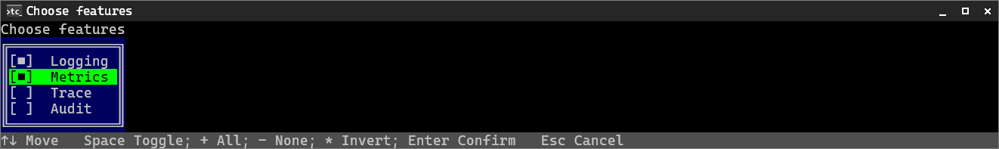
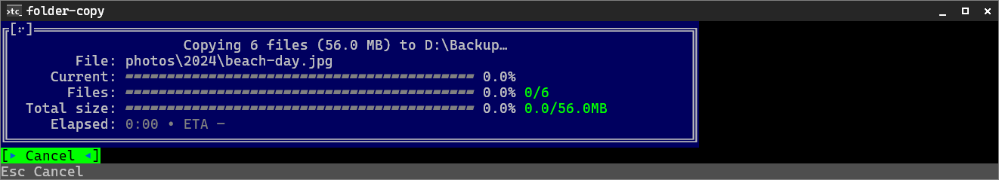

# Semi-Interactive Prompts

TigerCli has two prompt paths:

- Parser-driven prompts collect missing command arguments and options before a handler runs.
- Direct `TigerTui` prompts are called by app code for additional choices, confirmations, or short workflows that are not part of command-line binding.

Prefer parser-driven prompts for normal command inputs. They already understand command metadata, prompt policy, provider-backed choices, validation, and `--non-interactive`.

Use direct `TigerTui` prompts when the command has already started and needs a bounded interaction, such as confirming a destructive action or choosing from data discovered during execution.

## Overview

Direct prompts are inline and modal. They do not take over the full terminal screen, and they return a value or `null` when canceled, timed out, token-canceled, or not allowed by the shell.

```csharp
using ItTiger.TigerCli.Tui;

var confirmed = await TigerTui.ConfirmAsync("Continue?");
if (confirmed != true)
    return 1;
```

For command input such as missing `--connection` or `<project>`, use [prompting and providers](prompting-and-providers.md) instead. Direct prompts are for command behavior, not for reimplementing argument binding.

## Interaction Mode Safety

Semi-interactive prompts must respect [TigerCliInteractionMode](https://rkozlowski.github.io/TigerCli/api/ItTiger.TigerCli.Enums.TigerCliInteractionMode.html).

Framework-owned parser prompting already handles `--non-interactive`. If the user passes `--non-interactive`, parser prompts do not run and prompt providers are not called.

Direct `TigerTui` calls are app code. The default overloads use `InlineShell.Instance`; they do not automatically receive a command handler's resolved interaction mode. In command handlers, guard direct prompts with `settings.InteractionMode`:

```csharp
using ItTiger.TigerCli.Enums;
using ItTiger.TigerCli.Tui;

if (settings.InteractionMode == TigerCliInteractionMode.NonInteractive)
{
    TigerConsole.MarkupErrorLine("Confirmation is required; rerun without --non-interactive.");
    return 1;
}

var confirmed = await TigerTui.ConfirmAsync("Apply changes?");
if (confirmed != true)
    return 1;
```

When you have an `ICliAppShell`, prefer the shell-injected overloads:

```csharp
var index = await TigerTui.SelectIndexAsync(shell, "Pick one", ["Local", "Demo"]);
```

If that shell is non-interactive, the prompt helper returns `null` without rendering or reading input.

Avoid raw `Console.ReadLine()` for command workflows. It bypasses TigerCli's interaction model and can hang scripts.

## Select Prompts

Use `SelectIndexAsync` when you want the selected row index.

```csharp
using ItTiger.TigerCli.Tui;

int? index = await TigerTui.SelectIndexAsync(
    "Choose environment",
    ["Local", "Demo", "Production"]);

if (index is null)
    return 1;
```

Use `SelectAsync` when you want TigerCli to map the selected row back to a value.

```csharp
string? environment = await TigerTui.SelectAsync(
    "Choose environment",
    ["local", "demo", "prod"]);
```

For key/label choices, use `OptionItem<T>`:

```csharp
using ItTiger.TigerCli.Primitives;

string? key = await TigerTui.SelectAsync(
    "Choose connection",
    [
        new OptionItem<string>("local", "Local connection"),
        new OptionItem<string>("demo", "Demo connection")
    ]);
```

Select behavior:

- Up/Down moves the active row.
- Home/End moves to the first/last row.
- PageUp/PageDown moves by the viewport page size.
- Enter confirms the active row.
- Escape returns `null`.
- Timeout or cancellation returns `null`.
- Empty item lists render a localized empty state and are not confirmable.


`SelectAsync<TEnum>` is also available for enum values:

```csharp
Mode? mode = await TigerTui.SelectAsync<Mode>("Choose mode");
```

Direct enum select labels use enum member names. Parser-driven enum prompts support app enum text localization through the command-processing path.

## Text Input And Secret Input

Use `InputAsync` for text entry.

```csharp
string? name = await TigerTui.InputAsync("Name");
if (name is null)
    return 1;
```

You can provide an initial value and width:

```csharp
string? schema = await TigerTui.InputAsync(
    "Schema",
    initialValue: "dbo",
    width: 20);
```

Text input supports normal editing keys such as Left, Right, Home, End, Backspace, and Delete. It also uses the key character payload, so Unicode input such as Polish letters is preserved when the terminal supplies those characters.

Use `SecretInputAsync` when the prompt should mask rendered text:

```csharp
string? pin = await TigerTui.SecretInputAsync("PIN");
```

Secret input renders bullets but returns the real text.

Both text helpers return `null` on Escape, timeout, token cancellation, or interaction-not-allowed.

## Confirm Prompts

Use `ConfirmAsync` for yes/no decisions.

```csharp
bool? confirmed = await TigerTui.ConfirmAsync(
    "Delete project?",
    preselect: false);

if (confirmed != true)
    return 1;
```

Confirm behavior:

- Enter confirms the active choice.
- Up/Down changes the active choice.
- `true` maps to Yes.
- `false` maps to No.
- Escape, timeout, cancellation, or interaction-not-allowed returns `null`.

Yes/No labels are framework-owned and localized from the shell culture.

## Multi-Select Prompts

Use `MultiSelectIndexesAsync` when you want selected row indexes.

```csharp
int[]? indexes = await TigerTui.MultiSelectIndexesAsync(
    "Choose features",
    ["Logging", "Metrics", "Trace"]);
```

Use `MultiSelectAsync<T>` when you want selected items.

```csharp
IReadOnlyList<int>? ports = await TigerTui.MultiSelectAsync(
    "Choose ports",
    [80, 443, 8080],
    port => port.ToString());
```

Use `MultiSelectFlagsAsync<TEnum>` for `[Flags]` enums.

```csharp
[Flags]
public enum Features
{
    None = 0,
    Logging = 1,
    Metrics = 2,
    Trace = 4,
    All = Logging | Metrics | Trace
}

Features? features = await TigerTui.MultiSelectFlagsAsync<Features>(
    "Choose features",
    selected: Features.Logging);
```

Multi-select behavior:

- Space toggles the active row.
- Enter confirms.
- Escape, timeout, cancellation, or interaction-not-allowed returns `null`.
- Empty selection is valid when items exist.
- Empty item lists are not confirmable.
- Selected indexes are returned in original item order.
- Flags prompts show non-zero single-bit enum values only.
- The returned flags value is the bitwise OR of selected values.



## Folder Select Prompts

Use `SelectFolderAsync` to let the user navigate the filesystem and pick a folder, for example a destination or source directory.

```csharp
string? destination = await TigerTui.SelectFolderAsync(
    "Choose destination folder",
    initialPath: @"D:\Media\Movies");

if (destination is null)
    return 1;
```

`InlineFolderSelect` follows `InlineSelect` semantics: the highlighted row is the selection, Enter confirms it, and Escape cancels. Enter never opens a folder.

Folder-select behavior:

- Up/Down/Home/End/PageUp/PageDown move the highlighted row.
- Enter confirms the highlighted folder and returns its full path.
- Space or Right opens (navigates into) the highlighted folder, but only when it has subfolders; otherwise nothing happens.
- Left or Backspace navigates to the parent location. At the top (the Windows drive list, or Unix `/`) it does nothing.
- Escape, timeout, cancellation, or interaction-not-allowed returns `null`.
- The current location is shown above the list; openable folders are marked with `›`.

To select a folder, highlight it in its parent's listing and press Enter — you do not need to open it first. The initial path is treated as the folder to highlight: `D:\Media\Movies` starts in `D:\Media` with `Movies` highlighted. Unresolvable or unreadable initial paths fall back to the closest readable ancestor, and ultimately to the drive list (Windows) or `/` (Unix).

On Windows the top level is the drive list (`C:\`, `D:\`, …); opening a drive shows its child directories, and navigating up from a drive root returns to the drive list. On non-Windows the root is `/`.

Navigation and platform behavior live behind `IFolderBrowser`. The default `FileSystemFolderBrowser` is backed by `System.IO` and is exception-safe: inaccessible, missing, or transiently failing folders are skipped rather than crashing the prompt. Tests and custom hosts can supply their own `IFolderBrowser` through the shell-injected overload.

For command inputs, prefer parser-driven folder picker prompts with `[TigerCliFolderSelect]` instead of calling `SelectFolderAsync` directly. [Folder Copy](../examples/folder-copy.md) shows that pattern with required `--source` and `--destination` options.

## Layout And Behavior

TigerTui prompts render as inline modal regions. They are intentionally smaller than a full-screen terminal UI.

Typical prompt rendering includes:

- an optional title row
- a frame around the prompt region
- prompt content such as a select list or input field
- a label row for text input prompts
- a hint/status row when the control needs one
- scrolling and scrollbars for long lists

The shell handles keyboard input and rerenders after navigation. It does not switch to an alternate full-screen application model.

Rendered storyboards of the select and multi-select prompts — frames captured from scripted `TestShell` runs of the real modal loop — are committed at [`docs/examples/tui-storyboards.html`](../examples/tui-storyboards.html).

For the design rationale and lower-level control model, see [semi-interactive TUI design](../design/semi-interactive-tui.md).

## Spinners

`SpinnerTicker` owns the spinner frames and timing. It carries no knowledge of any control, overlay, or
title: the frame strings it cycles are **raw content**, and whatever renders them (an overlay, the
terminal title) decides their presentation. Controls never re-declare frame lists.

Frames come either from a predefined [SpinnerFrameSet](https://rkozlowski.github.io/TigerCli/api/ItTiger.TigerCli.Enums.SpinnerFrameSet.html) or from a custom sequence:

```csharp
// Predefined frame set (default interval).
var dots = new SpinnerTicker(SpinnerFrameSet.Dots6);

// Predefined set with a custom interval.
var slow = new SpinnerTicker(SpinnerFrameSet.Line, TimeSpan.FromMilliseconds(120));

// Custom frames (must be non-empty and contain no null/empty frame).
var custom = new SpinnerTicker(TimeSpan.FromMilliseconds(80), ["◐", "◓", "◑", "◒"]);
```

The default frame set (`SpinnerFrameSet.Default`) is the four-step braille spinner `⠖ ⠲ ⠴ ⠦`; it is what
a plain `new SpinnerTicker()` and the activity dialog use. The curated predefined sets are `Default`,
`Dots6`, `Dots8`, `Slide`, `SlideBounce`, `Snake`, and `Line`. Read a set's raw frames with
`SpinnerTicker.Frames(SpinnerFrameSet.Dots8)`.

### Activity dialog overloads

The full activity API takes a title and an `ActivityDialogSpec`:

```csharp
await TigerTui.RunActivityAsync(title, spec, operation);
```

For common cases there are convenience overloads. Drop the title, or skip the spec entirely and pass a
static message (TigerCli builds a one-row, one-column, left-aligned spec for you):

```csharp
// Spec without a title.
await TigerTui.RunActivityAsync(spec, operation);

// Static message with a title.
await TigerTui.RunActivityAsync("Importing", "Crunching numbers…", operation);

// Static message without a title.
await TigerTui.RunActivityAsync("Crunching numbers…", operation);
```

Each form has a value-returning (`Task<T>`) and a value-less (`Task`) variant, plus a shell-injected
overload, and all keep the same `stopMode`, `spinner`, `timeout`, and `ct` parameters as the full API.
The static message is a trusted activity text template (like an `ActivityTextElement`), so it may contain
TigerCli markup; write literal braces as `{{`/`}}`. In non-interactive mode, static-message overloads
print that same message once as their default status line while still running the operation body
headlessly. For richer layouts (progress bars, multiple rows), or when non-interactive output should
differ from the visible activity message, build an `ActivityDialogSpec` and call
`SetNonInteractiveMessage(...)`.

[Folder Copy](../examples/folder-copy.md) is the public real-operation sample for this: it scans with a simple activity and copies with a rich activity dialog containing current-file, files, bytes, elapsed, and ETA rows.



An activity is *work-with-UI*, not a prompt, so it behaves differently from `SelectAsync`/`ConfirmAsync`
under `--non-interactive`. In non-interactive mode the dialog is suppressed but the operation body still
runs headlessly, and the result is returned normally — the call never fails with `InteractionNotAllowed`
and never reports a spurious `Cancelled`. You do not need to guard `RunActivityAsync` behind a
`settings.InteractionMode` check. See
[interaction modes](interaction-modes.md#interaction-is-disabled-not-execution).

Prefer a single activity-based execution path:

```csharp
var spec = ActivityDialogSpec.Create()
    .SetNonInteractiveMessage("Importing card...")
    .AddColumn(align: CliTextAlignment.Left)
    .AddRow("status", r => r.Cell(0).Text("{0}").Values("Starting..."))
    .Build();

var result = await TigerTui.RunActivityAsync(
    "Import",
    spec,
    async (ctx, ct) =>
    {
        // one execution path
        // progress updates are safe in interactive and headless modes
    });
```

Do not write a direct path only for non-interactive mode:

```csharp
if (settings.InteractionMode == TigerCliInteractionMode.NonInteractive)
    await RunDirectAsync(...);
else
    await RunWithActivityAsync(...);
```

That split duplicates the main work, risks behavior drift, weakens tests, and bypasses activity
cancellation, timeout, and result semantics. Branch by interaction mode only when the command really has
different semantics, such as refusing a required prompt or changing confirmation policy.

### Activity dialog spinner

The rich activity dialog (`RunActivityAsync`) shows a spinner on its top frame. Configure it with an
optional `ActivitySpinnerSpec`:

```csharp
// Default: SpinnerTicker's default frame set and interval.
await TigerTui.RunActivityAsync(title, spec, operation);

// A predefined frame set (with an optional interval).
await TigerTui.RunActivityAsync(title, spec, operation,
    spinner: ActivitySpinnerSpec.FromFrameSet(SpinnerFrameSet.Dots8));

// An externally-created ticker the caller owns.
await TigerTui.RunActivityAsync(title, spec, operation,
    spinner: ActivitySpinnerSpec.FromTicker(myTicker));
```

A frame-set spec yields an idle `SpinnerTicker` that the dialog starts while the operation runs and stops
on completion. An external ticker is used as-is; the dialog starts/stops it only when it is itself a
`SpinnerTicker`. Frames are raw — the dialog's overlay brackets them, and the title prefix (below) uses
the raw frame.

### Progress-bar styles

A progress bar in an `ActivityDialogSpec` can use a predefined [ProgressBarStyle](https://rkozlowski.github.io/TigerCli/api/ItTiger.TigerCli.Enums.ProgressBarStyle.html) glyph style via the optional `style`
parameter on `ProgressBar(...)`, and optional end caps via the separate `caps` parameter. Its columns use [CliTextAlignment](https://rkozlowski.github.io/TigerCli/api/ItTiger.TigerCli.Enums.CliTextAlignment.html) and [CliColumnSizing](https://rkozlowski.github.io/TigerCli/api/ItTiger.TigerCli.Enums.CliColumnSizing.html) for layout. The defaults
keep the original `█`/`░` look with no caps, so existing specs are unaffected; the other styles help
adjacent or stacked bars read more cleanly.

```csharp
var spec = ActivityDialogSpec.Create()
    .AddColumn(width: 10, align: CliTextAlignment.Right)
    .AddColumn(sizing: CliColumnSizing.Star)
    .AddRow("dl", r => r
        .Cell(0).Text("Download:")
        .Cell(1).ProgressBar(valueIndex: 0, maxValueIndex: 1,
            style: ProgressBarStyle.Square, caps: ProgressBarCaps.Brackets)
        .Values(0, 100))
    .Build();
```

| `ProgressBarStyle` | Filled / track | Notes |
|---|---|---|
| `Default` | `█` / `░` | the original bar; the implicit default |
| `Line` | `━` / `─` | |
| `Square` | `■` / `□` | |
| `VerticalBar` | `▮` / `▯` | |
| `Dash` | `▰` / `▱` | |

Caps are an orthogonal decoration that composes with **any** style:

| [ProgressBarCaps](https://rkozlowski.github.io/TigerCli/api/ItTiger.TigerCli.Enums.ProgressBarCaps.html) | Effect | Notes |
|---|---|---|
| `None` | no caps; bar fills the full width | the implicit default |
| `Brackets` | `[` … `]` around the bar | end caps reserve the outer cells; dropped if the strip is too short to hold them plus ≥1 interior cell |

The style only changes glyphs and caps only add the end decoration — in single-colour mode the bar's colour
stays uniform (one theme style across the whole strip, caps included), exactly like the default bar. Place
the bar over a `Star` column so `CliGrid` resolves its width.

#### Multi-colour bars

A third, independent axis — `colorMode` — chooses how the bar is *coloured*. It composes with any glyph
style and caps. The default `Single` is the uniform bar above; the multi-colour modes use **one glyph for
every cell** (the chosen family's solid glyph) and distinguish the parts by colour, drawn from semantic
theme styles so each theme paints them appropriately:

| [ProgressBarColorMode](https://rkozlowski.github.io/TigerCli/api/ItTiger.TigerCli.Enums.ProgressBarColorMode.html) | Colours | Theme styles used |
|---|---|---|
| `Single` | one uniform colour (distinct filled/track glyphs) | the column style (or `Accent`) |
| `TwoColor` | done / not-done | `ProgressBarDone`, `ProgressBarRemaining` |
| `ThreeColor` | done / not-done / complete | adds `ProgressBarComplete`, applied **only at exactly 100%** |

```csharp
var spec = ActivityDialogSpec.Create()
    .AddColumn(width: 10, align: CliTextAlignment.Right)
    .AddColumn(sizing: CliColumnSizing.Star)
    .AddRow("dl", r => r
        .Cell(0).Text("Download:")
        .Cell(1).ProgressBar(valueIndex: 0, maxValueIndex: 1,
            style: ProgressBarStyle.Line, colorMode: ProgressBarColorMode.ThreeColor)
        .Values(0, 100))
    .Build();
```

The recommended multi-colour glyphs are the solid families `━` (`Line`), `█` (`Default`), `■` (`Square`),
and `▰` (`Dash`). Colours are resolved in the activity control from the theme — overlays themselves stay
theme-agnostic — and built-in themes ship sensible defaults (done → accent, not-done → muted, complete →
green). The `ThreeColor` "complete" colour appears only when progress is truly 100%, never when rounding
merely fills the last cell.

### Stopping an activity (cooperative cancellation)

An activity dialog exposes exactly **one** stop action — never Cancel and Abort together. Choose it with
[ActivityStopMode](https://rkozlowski.github.io/TigerCli/api/ItTiger.TigerCli.Enums.ActivityStopMode.html):

```csharp
// Cancel (the default): "Cancel" button, "Cancel this operation?" prompt, "Cancelling…" state.
await TigerTui.RunActivityAsync(title, spec, operation);

// Abort: "Abort" button, "Abort this operation?" prompt, "Aborting…" state.
await TigerTui.RunActivityAsync(title, spec, operation,
    stopMode: ActivityStopMode.Abort);
```

Both modes cancel the same operation token; the distinct wording and the `Aborted` outcome
(vs `Cancelled`) let callers treat a forceful stop differently. The stop button and the Escape key both
request the configured stop action, so they always agree.

How stopping works: TigerCli requests cancellation by **cancelling the operation's `CancellationToken`
and changing the dialog state** to "Cancelling…"/"Aborting…". At that point the request has already been
accepted, so the dialog shows **no action button** — it is only waiting for the operation to finish. The
operation **must observe the provided `CancellationToken`** and stop promptly where practical; the dialog
will not close until it does.

There are two valid ways for the operation to respond.

**Pattern 1 — throw cancellation.** Let cancellation surface as an `OperationCanceledException`:

```csharp
ct.ThrowIfCancellationRequested();
await DoWorkAsync(item, ct);
```

Recommended when cancellation simply means "the operation did not complete" and no domain-specific partial
result is needed. The dialog observes the cancellation and reports `Cancelled`/`Aborted` with no value.

**Pattern 2 — return a controlled result.** Check the token at a checkpoint and return your own result:

```csharp
if (ct.IsCancellationRequested)
{
    await SavePartialStateAsync();
    return ImportResult.Cancelled(processed);
}
```

Recommended when cleanup, rollback, partial progress, or a domain-specific cancellation result is needed.
The operation completes normally (from the dialog's perspective) and your value is returned through
`ActivityResult<T>.Value`.

Note that passing the token into awaited APIs (`Task.Delay(…, ct)`, `await DoWorkAsync(item, ct)`, …) may
throw `OperationCanceledException` **before** your next explicit `IsCancellationRequested` check. That is
usually correct (Pattern 1). If you need a controlled domain result (Pattern 2), use explicit checkpoints
and avoid threading the token into the awaited calls whose interruption you want to handle yourself.

## Spinner Title Prefix

Controls can expose periodic activity overlays, including `SpinnerTicker`. When an app run has terminal title management enabled, an active `SpinnerTicker` also prefixes the current terminal title with its current frame:

```text
⠖ Tiger Media Flow - Scanning
⠲ Tiger Media Flow - Scanning
⠴ Tiger Media Flow - Scanning
⠦ Tiger Media Flow - Scanning
```

The spinner still owns only frames and timing. The modal loop observes active spinner overlays after the same ticker advancement used for on-screen rendering and updates the current sink title only when the composed title changes.

Disable only this spinner-title prefixing while keeping the base app/command title:

```csharp
TigerCliApp.CreateBuilder()
    .UseAssemblyMetadata(typeof(TmfApp).Assembly)
    .DisableSpinnerTitlePrefix();
```

## Advanced: Custom Controls

The built-in prompts cover the common cases, but TigerCli does not seal the inline system behind them. An
advanced caller can build a custom control, wrap it in a dialog, and run it through the same public modal
loop the framework uses — without referencing any internal type.

`ICliAppShell` is the public shell contract; the concrete console-backed implementation
(`InlineShell`) remains an internal detail. Reach the real shell through `TigerTui.DefaultShell`, and run
custom controls/dialogs with `TigerTui.RunControlAsync` / `TigerTui.RunDialogAsync`. Each has a
shell-injected overload, so the same code runs against a `TestShell` in unit tests.

```csharp
using ItTiger.TigerCli.Enums;
using ItTiger.TigerCli.Primitives;
using ItTiger.TigerCli.Rendering;
using ItTiger.TigerCli.Tui;
using ItTiger.TigerCli.Tui.Abstractions;
using ItTiger.TigerCli.Tui.Controls;

// 1. Derive from the public InlineControlBase. Build your view with CliGrid, handle keys, and
//    optionally complete the dialog by returning a result.
sealed class MyControl(ICliAppShell shell, string text) : InlineControlBase(shell)
{
    public override object? Payload => text;

    public override CliGrid ToGrid()
    {
        var grid = new CliGrid(1, 1);
        grid.Set(0, 0, text);
        return grid;
    }

    public override InlineKeyResult HandleKey(KeyEvent key) =>
        key.Key == ConsoleKey.Enter
            ? InlineKeyResult.WithResult(DialogResultKind.Ok)
            : InlineKeyResult.NotHandled;
}

// 2a. Simplest: let the facade host the control in an InlineDialog and run it on the default shell.
DialogResult result = await TigerTui.RunControlAsync(
    new MyControl(TigerTui.DefaultShell, "Press Enter"), title: "Custom");

// 2b. Or construct the InlineDialog yourself (e.g. to pass a confirmation policy) and run that.
var shell = TigerTui.DefaultShell;
var dialog = new InlineDialog(shell, "Custom", new MyControl(shell, "Press Enter"),
    confirmation: InlineDialogConfirmationPolicy.ConfirmCancel);
DialogResult dr = await TigerTui.RunDialogAsync(dialog);
```

Both helpers honour the same `timeout` and `ct` parameters and the same [DialogResultKind](https://rkozlowski.github.io/TigerCli/api/ItTiger.TigerCli.Enums.DialogResultKind.html) outcomes
(`Ok` / `Cancel` / `Timeout` / `TokenCancel` / `SystemCancel`) as the built-in prompts — the built-ins are
themselves thin adapters over this composition. For the control/widget contract and the layout model, see
[semi-interactive TUI design](../design/semi-interactive-tui.md); for direct grid layout, see
[CliGrid](cli-table.md). Ownership stays separated: controls compose, the shell owns the modal lifecycle,
and `CliGrid` owns layout/rendering.

## Localization

Framework-owned prompt text is localized through the shell culture. This includes confirm labels, empty select text, multi-select hints, and folder-select navigation hints, root label, and empty state.

```csharp
var shell = new TestShell(culture: CultureInfo.GetCultureInfo("pl-PL"));
bool? confirmed = await TigerTui.ConfirmAsync(shell, "Kontynuować?");
```

App-owned item labels are supplied by the app:

```csharp
await TigerTui.SelectAsync(
    "Choose connection",
    [
        new OptionItem<string>("local", localizedLocalLabel),
        new OptionItem<string>("demo", localizedDemoLabel)
    ]);
```

Keep keys stable and language-neutral. Labels are display text and may change by culture.

See [localization](localization.md) for the broader CLI localization model.

## Testing Direct Prompts

For app-level command tests, prefer `TigerCliAppTestHost`. It runs the real app pipeline, captures stdout/stderr, and provides prompt answer helpers.

For low-level direct prompt tests, use `TestShell` and `TestTerminal`.

```csharp
using ItTiger.TigerCli.Tui;
using ItTiger.TigerCli.Tui.Testing;

var shell = new TestShell();
shell.Terminal.EnqueueKey(ConsoleKey.DownArrow);
shell.Terminal.EnqueueKey(ConsoleKey.Enter);

var result = await TigerTui.SelectIndexAsync(
    shell,
    "Pick one",
    ["Local", "Demo"]);

Assert.Equal(1, result);
```

This pattern lets you verify keyboard behavior, rendered text, non-interactive mode, timeouts, and shell culture.

See [app testing](app-testing.md) for command-level prompt tests.

## Common Mistakes

- Do not use direct prompts for values the parser can prompt for automatically.
- Do not prompt in non-interactive flows.
- Do not rely on default `TigerTui` overloads to know a command handler's resolved `--non-interactive` state.
- Do not use localized labels as stable keys.
- Do not bypass TigerCli interaction-mode rules with raw `Console.ReadLine()`.
- Do not mix raw console input with `TigerTui` prompts.
- Do not build long-lived full-screen workflows from inline prompts.

## Related Docs

- Use parser-driven prompts and providers with [prompting and providers](prompting-and-providers.md).
- Understand interaction rules in [interaction modes](interaction-modes.md).
- Test command prompt flows with [app testing](app-testing.md).
- Localize prompt text with [localization](localization.md).
- See folder picker and activity usage in [Folder Copy](../examples/folder-copy.md).
- Read the lower-level design in [semi-interactive TUI design](../design/semi-interactive-tui.md).
